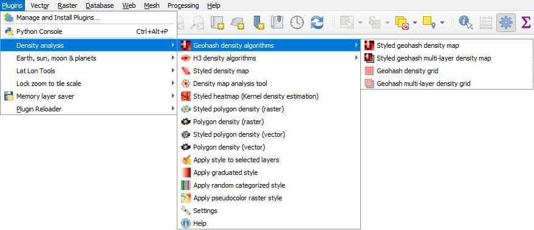
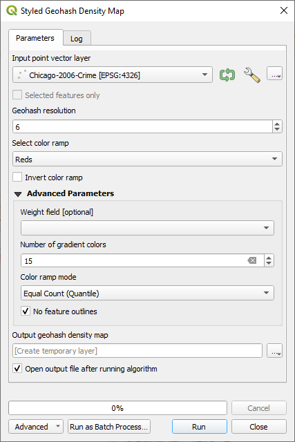
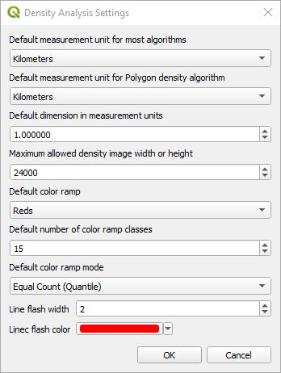

# QGIS Density Analysis Plugin

This plugin adds additional density heatmap algorithms to QGIS including geohash, H3, styled heatmap, and polygon density maps. It adds a vector density heatmap explorer to examine hotspot areas of greatest concentrations. It wraps the QGIS Heatmap (Kernel Density Estimation) algorithm into a new version that automatically styles the layer and allows the user to specify the cell size in various units of measure and not just the units of the layer's CRS. It provides an algorithm to create a raster density of polygons. It has processing algorithms to create a gradient style, random style, and raster pseudocolor style so that they can be used in QGIS models. Another tool allows a copied style or a .qml file to be pasted onto all selected layers. Once installed, the plugin is located under ***Plugins->Density analysis*** in the QGIS menu, on the toolbar, and can be found in the *Processing Toolbox* under *Density analysis*. This shows plugin from the main menu with ***Geohash density algorithms*** expanded.

This shows the expanded ***H3 density algorithms***.

Note that several algorithms in this plugin use **H3 (Hexagonal hierarchical geospatial indexing system)**. This is an incredibly fast algorithm for generating hexagon density maps, but requires installation of the **H3 python library**. The H3 package can be installed by running the OSGeo4W shell as system administrator and running 'pip install h3' or whatever method you use to install python packages. If H3 is not installed, the rest of the algorithms will still work, but you will not be able to run the H3 algorithms. In one test using the QGIS ***Create grid*** processing algorithm, followed by ***Count points in a polygon*** algorithm took 63.18 seconds to process spatially indexed point data. To do the same thing with H3 only took 3.79 seconds.

Many of the default parameters in the algorithms can be set from the settings dialog found in ***Plugins->Density analysis->Settings***. This allows the user to customize these settings one time.

##  Styled density map

Given point features, this will create a rectangle, diamond, or hexagon grid histogram of points that occur in each polygon grid cell. This algorithm uses the QGIS ***Count points in polygon*** algorithm which is fairly time intensive even though it has been masterfully implemented in core QGIS and significantly beats the speed implemented in commercial software. To optimize the speed make sure your input data is spatially indexed; otherwise, this algorithm will be painfully slow. The advantage to this algorithm is that it gives the most control over the size of the polygon grid cells. If speed is more important then use ***Styled geohash density map*** or ***Styled H3 density map*** algorithm. Both of these use geohash indexing to count points in each geohash grid cell and are very fast. The former creates a square or rectangular grid and H3 creates a hexagon grid. For H3 support, the H3 library needs to be installed in QGIS. The disadvantage of these geohash density maps is that they have fixed resolutions and you cannot choose anything in between, but this is also what makes them fast.

Here is an example of crime in Chicago. Each point on the left is a criminal event. On the right is a hexagon heatmap counting the number of events in each cell and displaying it as a heatmap. The darker the red, the more crime is in that area. 

This shows the parameters used in the algorithm.

These are the basic input parameters:

* ***Input point vector layer*** - Select one of your point feature layers. Note that counting features in polygons is a time consuming process. If you have a large data set, make sure your input point vector layer has a spatial index; otherwise, this will be very slow.
* ***Grid extent*** - Select a grid extent. In this case the extent comes from the extent of the input vector layer. If no extent is selected, it defaults to the extent of the ***Input point vector layer***.
* ***Grid type*** - This is the grid type that is created. It can either be a rectangle, diamond, or hexagon. 
* ***Cell width in measurement units*** - This is the width of the grid cell in terms of the ***Measurement unit***.
* ***Cell height in measurement units*** - This is the height of the grid cell in terms of the ***Measurement unit***.
* ***Measurement unit*** - This is the measuring unit used for the cell width and heights. Choices are Kilometers, Meters, Miles, Yards, Feet, Nautical Miles, and Degrees.
* ***Select color ramp*** - This is a list of the QGIS color ramps (default Reds) that will be applied to the layer. The default value can be changed in ***Settings***.
* ***Invert color ramp*** - When checked, the ordering of the color ramp is inverted.

These are the Advanced Parameters.

* ***Minimum cell histogram count*** - This is minimum number of features required to be within each cell for a cell to be created. A value of 0 will display the entire grid. A value of 1 means that at least one event was within the cell boundaries.
* ***Maximum grid width or height*** - This prevents a grid of huge proportions from being created and allows the user to correct the input parameters. If the width or height of the grid is exceeded, then it generates an error with a message of the grid size that would be created by the current settings and the cell width or height that needs to be used to fit within this grid size. You can always increase this number if you want a denser grid.
* ***Weight field*** - An optional weight field can be used to assign weights to each point. If set, the count generated will be the sum of the weight field for each point contained by the polygon.
* ***Number of gradient colors*** - This specifies the number of gradient categories that are going to be used. This example uses a value of 15. When we look at the output layer, it shows each category and the number of events that can occur within the category.

    

* ***Color ramp mode*** - Select one of Equal Count (Quantile), Equal Interval, Logarithmic scale, Natural Breaks (Jenks), Pretty Breaks, or Standard Deviation. The default value change be changed in ***Settings***.
* ***No feature outlines*** - If checked, it will not draw grid cell outlines.

## Geohash density algorithms

There are four geohash density algorithm variations. Two are automatically styled and two of them work with multiple vector layers.

###  Styled geohash density map

This algorithm iterates through every point indexing them using a geohash with a count of the number of times each geohash has been seen. The bounds of each geohash cell is then created as a polygon. Depending on the resolution these polygons are either a square or rectangle. Here is an example.

This shows the algorithm's dialog.

These are the input parameters:

* ***Input point vector layer*** - Select one of your point vector layers.
* ***Geohash resolution*** - This is the resolution or size of each of the grid cells as follows:

<table style="margin-left: auto; margin-right: auto;">
<tr>
<th>Resolution Level</th>
<th>Approximate Dimensions</th>
</tr>
<tr>
<td style="text-align: center">1</td>
<td style="text-align: center">≤ 5,000km X 5,000km</td>
</tr>
<tr>
<td style="text-align: center">2</td>
<td style="text-align: center">≤ 1,250km X 625km</td>
</tr>
<tr>
<td style="text-align: center">3</td>
<td style="text-align: center">≤ 156km X 156km</td>
</tr>
<tr>
<td style="text-align: center">4</td>
<td style="text-align: center">≤ 39.1km X 19.5km</td>
</tr>
<tr>
<td style="text-align: center">5</td>
<td style="text-align: center">≤ 4.89km X 4.89km</td>
</tr>
<tr>
<td style="text-align: center">6</td>
<td style="text-align: center">≤ 1.22km X 0.61km</td>
</tr>
<tr>
<td style="text-align: center">7</td>
<td style="text-align: center">≤ 153m X 153m</td>
</tr>
<tr>
<td style="text-align: center">8</td>
<td style="text-align: center">≤ 38.2m X 19.1m</td>
</tr>
<tr>
<td style="text-align: center">9</td>
<td style="text-align: center">≤ 4.77m X 4.77m</td>
</tr>
<tr>
<td style="text-align: center">10</td>
<td style="text-align: center">≤ 1.19m X 0.596m</td>
</tr>
<tr>
<td style="text-align: center">11</td>
<td style="text-align: center">≤ 149mm X 149mm</td>
</tr>
<tr>
<td style="text-align: center">12</td>
<td style="text-align: center">≤ 37.2mm X 18.6mm</td>
</tr>
</table>

* ***Select color ramp*** - This is a list of the QGIS color ramps (default Reds) that will be applied to the layer. The default value can be changed in ***Settings***.
* ***Invert color ramp*** - When checked, the ordering of the color ramp is inverted.

These are the Advanced Parameters.

* ***Weight field*** - An optional weight field can be used to assign weights to each point. If set, the count generated will be the sum of the weight field for each point contained by the polygon.
* ***Number of gradient colors*** - This specifies the number of gradient categories that are going to be used. This example uses a value of 15. 
* ***Color ramp mode*** - Select one of Equal Count (Quantile), Equal Interval, Logarithmic scale, Natural Breaks (Jenks), Pretty Breaks, or Standard Deviation. The default value change be changed in ***Settings***.
* ***No feature outlines*** - If checked, it will not draw grid cell outlines.

The output geohash table contains a unique identifier **ID**, geoshash string **GEOHASH** and the count of number of points or weighted count of the number points within the geohash cell **NUMPOINTS**.

###  Geohash density grid

This is the same as ***Styled geohash density map***, but without the styling. The algorithm iterates through every point of the input layer indexing them using a geohash with a count of the number of times each geohash has been seen and saved to the **NUMPOINTS** attribute. The bounds of each geohash cell is then created as a polygon. Depending on the resolution these polygons are either a square or rectangle.

###  Styled geohash multi-layer density map

This is the same as the ***Styled geohash density map*** algorithm with the exception that it supports multiple input point vector layers which contribute to the output density map. If a ***Weight field*** is used, then all selected layers must contain the same weight attribute field. To select the input layers, click on the **"..."** button on the right and it will give a dialog with all of the point vector layers that are available to be included in the output density map.

###  Geohash multi-layer density grid

This is the same as ***Styled multi-layer geohash density map***, but without the styling. The algorithm iterates through every selected point vector layer and every point within the layer, indexing them using a geohash with a count of the number of times each geohash has been seen. The bounds of each geohash cell is then created as a polygon. Depending on the resolution these polygons are either a square or rectangle.

## H3 density algorithms

There are four H3 density algorithm variations. Two are automatically styled and two of them work with multiple vector layers.

These algorithms use the **H3 (Hexagonal hierarchical geospatial indexing system)** library for fast density map generation. They iterate through every point using H3 indexing with a count of the number of times each H3 index has been seen. Each H3 cell is then created as a polygon. The polygons are in a hexagon shape. 

To create H3 density maps you will need to install the H3 Library (<a href="https://h3geo.org/">https://h3geo.org/</a>).
The H3 package can be installed by running the OSGeo4W shell as system administrator and running 'pip install h3' or whatever method you use to install python packages. The H3 algorithms will give a warning message if H3 has not been installed.

###  Styled H3 density map

This algorithm generates a styled H3 density map from a point vector layer.

Here is an example.

This shows the algorithm dialog.

The parameters are as follows:

* ***Input point vector layer*** - Select one of your point vector layers.
* ***H3 resolution*** - This is the resolution or size of each of the grid cells and ranges from 0 to 15 as follows:

<table style="margin-left: auto; margin-right: auto;">
<tr>
<th>Resolution Level</th>
<th>Average Hexagon Edge Length</th>
</tr>
<tr>
<td style="text-align: center">0</td>
<td style="text-align: center">1107.71 km</td>
</tr>
<tr>
<td style="text-align: center">1</td>
<td style="text-align: center">418.68 km</td>
</tr>
<tr>
<td style="text-align: center">2</td>
<td style="text-align: center">158.24 km</td>
</tr>
<tr>
<td style="text-align: center">3</td>
<td style="text-align: center">59.81 km</td>
</tr>
<tr>
<td style="text-align: center">4</td>
<td style="text-align: center">22.61 km</td>
</tr>
<tr>
<td style="text-align: center">5</td>
<td style="text-align: center">8.54 km</td>
</tr>
<tr>
<td style="text-align: center">6</td>
<td style="text-align: center">3.23 km</td>
</tr>
<tr>
<td style="text-align: center">7</td>
<td style="text-align: center">1.22 km</td>
</tr>
<tr>
<td style="text-align: center">8</td>
<td style="text-align: center">461.35 m</td>
</tr>
<tr>
<td style="text-align: center">9</td>
<td style="text-align: center">174.38 m</td>
</tr>
<tr>
<td style="text-align: center">10</td>
<td style="text-align: center">65.91 m</td>
</tr>
<tr>
<td style="text-align: center">11</td>
<td style="text-align: center">24.91 m</td>
</tr>
<tr>
<td style="text-align: center">12</td>
<td style="text-align: center">9.42 m</td>
</tr>
<tr>
<td style="text-align: center">13</td>
<td style="text-align: center">3.56 m</td>
</tr>
<tr>
<td style="text-align: center">14</td>
<td style="text-align: center">1.35 m</td>
</tr>
<tr>
<td style="text-align: center">15</td>
<td style="text-align: center">0.51 m</td>
</tr>
</table>

* ***Select color ramp*** - This is a list of the QGIS color ramps (default Reds) that will be applied to the layer. The default value can be changed in ***Settings***.
* ***Invert color ramp*** - When checked, the ordering of the color ramp is inverted.

These are the Advanced Parameters.

* ***Weight field*** - An optional weight field can be used to assign weights to each point. If set, the count generated will be the sum of the weight field for each point contained by the polygon.
* ***Number of gradient colors*** - This specifies the number of gradient categories that are going to be used. This example uses a value of 15. 
* ***Color ramp mode*** - Select one of Equal Count (Quantile), Equal Interval, Logarithmic scale, Natural Breaks (Jenks), Pretty Breaks, or Standard Deviation. The default value change be changed in ***Settings***.
* ***No feature outlines*** - If checked, it will not draw grid cell outlines.

###  H3 density grid

This is the same as ***Styled H3 density map***, but without the styling. 

###  Styled H3 multi-layer density map
This is the same as the ***Styled H3 density map*** algorithm with the exception that it supports multiple input point vector layers which contribute to the output density map. If a Weight field is used, then all selected layers must contain the same weight attribute field. To select the input layers, click on the "..." button on the right and it will give a dialog with all of the point vector layers that are available to be included in the output density map.

###  H3 multi-layer density grid

This is the same as ***Styled multi-layer H3 density map***, but without the styling. The algorithm iterates through every selected vector layer and every point within the layer, indexing them using a H3 geohash index with a count of the number of times each index has been seen. The bounds of each geohash index cell is then created as a polygon.

###  H3 grid

This will create a grid of H3 polygons based on the extent of a layer, canvas, or user drawn extent. ***H3 Resolution*** is a value between 0 and 15 specifying the resolution of the H3 grid. 

##  Density map analysis tool

With this tool you can quickly look at the top scoring values. Select the original point layer and the density heatmap polygon layer generated by the above algorithms. ***ID*** should be set to a unique identifier, and ***Score*** should be set to the histogram count attribute. If the selected heatmap vector layer has the attributes ***id*** and ***NUMPOINTS***, these will be automatically selected.

Once the parameters have been set, click on ***Display Density Values*** and the top scores will be listed. If you click on any of entries only that grid cell will be display. A drop down set of actions selects what happens when clicking on one or more of the score entries.

* ***No action*** - No action is taken.
* ***Auto pan*** - The density map polygon layer will only display the selected polygons and hide all the rest. The QGIS canvas will pan to the center of all the selected features. You can click and drag to select more than one entry, or Ctrl-click to add or subtract from the selection.
* ***Pan+flash*** - All of the polygons in the density map polygon layer will be displayed. Only a single row can be selected at a time and the canvas will pan to the center of the selected polygon and will flash lines showing where it is located.
* ***Auto zoom*** - The density map polygon layer will only display the selected polygons and hide all the rest.  The QGIS canvas will zoom to the center of all the selected features. You can click and drag to select more than one entry, or Ctrl-click to add or subtract from the selection.

You can then examine the features within the grid cell. Here is an example view.

##  Styled heatmap (Kernel density estimation)

This algorithm is a wrapper for the native QGIS ***Heatmap (Kernel Density Estimation)*** algorithm, but adds automatic styling and simplifies specifying the pixel/grid size of the output image. The user specifies the measurement unit such as kilometers, meters, etc. rather than having to know the units used for the CRS. The algorithm creates a density heatmap raster image. The output image size will be based on the ***Cell/pixel dimension in measurement units*** parameter and bounding box of the input vector layer. If either dimension of the output image exceeds ***Maximum width of height dimensions of output image***, then an error will be generated and the user will need to either increase ***Cell/pixel dimension in measurement units*** or ***Maximum width or height dimensions of output image***.

The following are the main parameters.

* ***Input point layer*** - Select a point vector layer as input.
* ***Cell/pixel dimension in measurement units*** - For every point feature a kernel density function will be summed up by added it to the output raster image that is generated. This specifies the cell dimensions of each pixel in the output image. The total image size is calculated by the number of pixels it takes to span the bounding box of the vector layer.
* ***Kernel radius in measurement units*** - This acts as a blurring function centered on each vector input point. Its radius is in terms of the ***Measurement unit*** drop down box. This should be set larger than ***Cell/pixel dimension in measurement units***.
* ***Measurement unit*** - This is the unit of measure for the two above parameters and is one of the following: kilometers, meters, miles, yards, feet, nautical miles, and degrees.
* ***Select color ramp*** - This is a list of the QGIS color ramps that will be applied to the layer.
* ***Invert color ramp*** - When checked, the ordering of the color ramp is inverted.

These are ***Advanced Parameters***.

* ***Maximum width or height dimensions of output image*** - If the output image dimensions used to accumulate the heatmap results exceeds this value then the algorithm will generate an error. This is an error check to make sure excessively large images are not created. To fix this error, increase this value or the value of ***Cell/pixel dimension in measurement units***.
* ***Kernel shape*** - This is the shape of the kernel density function. The options are Quartic, Triangular, Uniform, Triweight, and Epanechnikov.
* ***Decay ration (Triangular kernels only)*** - This is used with a triangular kernel shape. See the QGIS Heatmap documentation for more information.
* ***Interpolation*** - Options are Discrete, Linear, and Exact.
* ***Mode*** - Options are Continuous, Equal Interval, and Quantile.
* ***Number of gradient colors*** - Specifies the number of gradient color classes.

##  Styled polygon density (raster)

Like the ***Styled Heatmap***, this algorithm uses a raster image to accumulate the summation of rasterized polygon layers and then automatically style the results. Here is an example of the result of summing a cluster of polygons.

The parameters in dialog box are as follows:

* ***Grid extent (defaults to layer extent)*** - Select a grid extent. In this case it is not set and defaults to the extent of the input layer.
* ***Cell width in measurement units*** - If ***Measurement unit*** is set to **Dimensions in pixels** then this represents the width of the output image that will be created to span the extent of the polygon data; otherwise, each pixel cell represents the width in terms of ***Measurement unit***. For example if ***Measurement unit*** is set to Kilometers and this value is set to 2, then every pixel represents a width of 2 kilometers.
* ***Cell height in measurement units*** - If ***Measurement unit*** is set to **Dimensions in pixels** then this represents the height of the output image that will be created to span the extent of the polygon data; otherwise, each pixel represents the height in terms of ***Measurement unit***. For example if ***Measurement unit*** is set to Meters and this value is set to 20, then every pixel represents a height of 20 meters.
* ***Measurement unit*** - This specifies what the values represent in ***Cell width in measurement units*** and ***Cell height in measurement units***. The values are **Kilometers**, **Meters**, **Miles**, **Yards**, **Feet**, **Nautical Miles**, **Degrees**, and **Dimensions in pixels**.
* ***Select color ramp*** - This is a list of the QGIS color ramps that will be applied to the layer.
* ***Invert color ramp*** - When checked, the ordering of the color ramp is inverted.

These are the ***Advanced Parameters***.

* ***Maximum width or height dimensions for output image*** - Because it would be easy to create an astronomically large image if inappropriate values are used above, this provides a check to make sure they are reasonable. It will generate an error if the width or height of the resulting output image were to exceed this value.
* ***Interpolation*** - Options are Discrete, Linear, and Exact.
* ***Mode*** - Options are Continuous, Equal Interval, and Quantile.
* ***Number of gradient colors*** - Specifies the number of gradient color class divisions.

##  Polygon density (raster)

This is the same as the ***Styled density (raster)***, but without the styling. It uses a raster image to accumulate the summation of rasterized polygon layers. Here is an example of the result of summing a cluster of polygons.

The parameters in dialog box are as follows:

* ***Grid extent (defaults to layer extent)*** - Select a grid extent. In this case it is not set and defaults to the extent of the input layer.
* ***Cell width in measurement units*** - If ***Measurement unit*** is set to **Dimensions in pixels** then this represents the width of the output image that will be created to span the extent of the polygon data; otherwise, each pixel cell represents the width in terms of ***Measurement unit***. For example if ***Measurement unit*** is set to Kilometers and this value is set to 2, then every pixel represents a width of 2 kilometers.
* ***Cell height in measurement units*** - If ***Measurement unit*** is set to **Dimensions in pixels** then this represents the height of the output image that will be created to span the extent of the polygon data; otherwise, each pixel represents the height in terms of ***Measurement unit***. For example if ***Measurement unit*** is set to Meters and this value is set to 20, then every pixel represents a height of 20 meters.
* ***Measurement unit*** - This specifies what the values represent in ***Cell width in measurement units*** and ***Cell height in measurement units***. The values are **Kilometers**, **Meters**, **Miles**, **Yards**, **Feet**, **Nautical Miles**, **Degrees**, and **Dimensions in pixels**.
* ***Maximum width or height dimensions for output image*** - Because it would be easy to create an astronomically large image if inappropriate values are used above, this provides a check to make sure they are reasonable. It will error out if the width or height of the resulting output image were to exceed this value.

##  Styled polygon density (vector)

This is similar to the ***Polygon density (raster)*** with the exception that it is vector and not raster based. It calls the QGIS ***Vector->Geoprocessing Tools->Union*** algorithm to break up the polygons wherever they overlap. It then runs the QGIS ***Aggregate*** algorithm to count the number of polygons that have the same geometry effectively returning the density of each polygon area.

WARNING: There appears to be a bug in the QGIS ***Union*** algorithm which I am guessing occurs when a polygon is broken up so small that it not a polygon. If you seen an error message with this algorithm, try running just the ***Union*** algorithm on your data without an overlay layer. If that fails report the ***Union*** error to the QGIS development team. If you get an error message, you will need to use the raster version of the polygon density algorithm. Here is an example of the output.

The parameters in dialog box are as follows:

##  Polygon density (vector)

This is the same as the ***Styled density (vector)***, but without the styling.

##  Apply style to selected layers

QGIS lacks a function to paste a style to more than one layer so this tool was developed to fix that lack in capability. If you have a .qml style or have a style copied on the clipboard you can apply it to all the selected layers. 

When pasting a graduated style the symbol class values are preserved unless ***Automatically reclassify graduated layers*** is checked. When checked, each layer's minimum and maximum are evaluated along with the graduated mode to reclassify the values.

## Applying graduated and random categorized styles

The purpose of these two algorithms, is to set random and graduated styles using an algorithm. This makes it possible to set a layer's style in the model builder.

*  ***Apply a graduated style*** - This applies a graduated style to a layer. This is one of the building blocks to create a heatmap.

    

    This parallels the layer styling panel. It does not include all the styling parameters, but focuses on those which are important for heatmap styling. Select your input layer, the style field, select one of the color ramps, mode and number of classes. Mode can be Equal Count (Quantile), Equal Interval, Logarithmic scale, Natural Breaks (Jenks), Pretty Breaks, or Standard Deviation. If ***No feature outlines*** is checked, then the features will not have outlines.

*  ***Apply a random categorized style*** - This applies a random categorized style to a layer.

    

    
    Specify the input layer and the field to distinguish between different categories. If ***No feature outlines*** is checked, then the features will not have outlines.

##  Apply a pseudocolor raster style

This achieves some of the functionality you get from right-mouse clicking on a single band image and selecting properties and selecting the *Symbology* tab and choosing ***Singleband pseudocolor*** for the ***Render type**. For more information on the parameters visit the QGIS documentation. These are the settings.

* ***Input raster layer*** - Choose an input raster layer.
* ***Color ramp name*** - This is a list of the QGIS color ramps that will be applied to the layer.
* ***Invert color ramp*** - When checked, the ordering of the color ramp is inverted.
* ***Interpolation*** - Options are Discrete, Linear, and Exact.
* ***Mode*** - Options are Continuous, Equal Interval, and Quantile.
* ***Number of gradient colors*** - Specifies the number of gradient color class divisions.

##  Settings

The settings are found in the QGIS menu under ***Plugins->Density Analysis->Settings***. These settings allow the user to set default values for some of the most common parameters in the algorithms. This setting is persistent from one launch of QGIS to the next. If the user is consistently using a certain color ramp or a certain cell density, these default parameters can be set and save time later on when then algorithms are run. Here are the default settings:

* ***Default measurement unit for most algorithms*** - This specifies the default unit of measure that is used by most of the algorithms. The values are **Kilometers**, **Meters**, **Miles**, **Yards**, **Feet**, **Nautical Miles**, and **Degrees**.
* ***Default measurement unit for Polygon density algorithm*** - This specifies the default unit of measure that is used by the polygon density algorithms. The values are **Kilometers**, **Meters**, **Miles**, **Yards**, **Feet**, **Nautical Miles**,  **Degrees**, and **Dimensions in pixels**.
* ***Default dimension in measurement units*** - This will be the default numerical number used for width, height or dimensions in the algorithms in terms of the respective measurement unit.
* ***Maximum allowed density image width or height*** - This default parameter is used by the algorithms that create image based density maps. It specifies the maximum width or height of the output image. If the algorithms exceed the value an error will be returned. This provides a check to make sure the algorithm settings are reasonable.
* ***Default color ramp*** - This setting will be used by the algorithms for the default color ramp.
* ***Default number of color ramp classes***  - This is the default number of color ramp colors or classes that are used by the algorithms.
* ***Default color ramp mode*** - This is the default color ramp mode used by the vector density maps for styling the output layer. The options are Equal Count (Quantile), Equal Interval, Logarithmic scale, Natural Breaks (Jenks), Pretty Breaks, or Standard Deviation.
* ***Line flash width*** - This is the width of the line flash marker lines used by the density hotspot explorer.
* ***Line flash color*** - This is the color of the line flash marker lines used by the density hotspot explorer.
