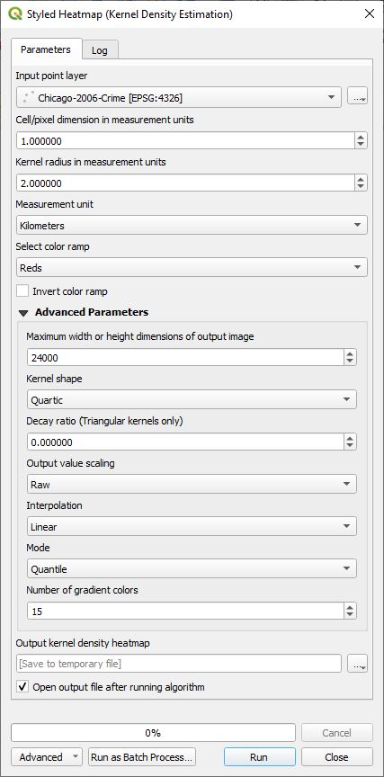
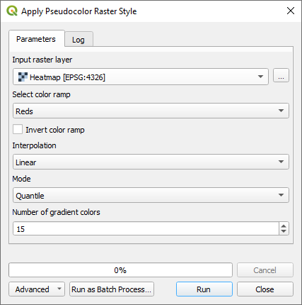

# QGIS Density Analysis Plugin

This plugin automates the creation of vector density heatmaps in QGIS with a heatmap explorer to examine the areas of greatest concentrations. It wraps the QGIS Heatmap algorithm into a new version that automatically styles the layer and allows the user to specify the cell size in various units of measure and not just the units of the layer's CRS. It provides an algorithm to create a raster density map of polygons. It has three processing algorithms to create a gradient style, random style, and raster pseudocolor style so that they can be used in QGIS models. Another tool allows a copied style or a .qml file to be pasted onto all selected layers. Once installed, the plugin is located under ***Plugins->Density analysis*** in the QGIS menu, on the toolbar, and can be found in the *Processing Toolbox* under *Density analysis*.

Note that several algorithms in this plugin use **H3** (Hexagonal hierarchical geospatial indexing system). This is an incredibly fast algorithm for generating hexagon density maps, but requires installation of the **H3 python library**. The H3 package can be installed by running the OSGeo4W shell as system administrator and running 'pip install h3' or whatever method you use to install python packages. In one test using the QGIS ***Create grid*** processing algorithm, followed by ***Count points in a polygon*** algorithm took 63.18 seconds to process spatially indexed point data. To do the same thing with H3 only took 3.79 seconds.

##  Styled density map

Given point features this will create a rectangle, diamond, or hexagon grid histogram of points that occur in each polygon grid cell. This algorithm uses the QGIS ***Count points in polygon*** algorithm which is fairly time intensive even though it has been masterfully implemented in core QGIS and significantly beats the speed implemented in commercial software. To optimize the speed make sure your input data is spatially indexed; otherwise, this algorithm will be painfully slow. The advantage to this algorithm is that it gives the most control over the size of the polygon grid cells. If speed is more important then use ***Styled geohash density map*** or ***Styled H3 density map*** algorithm. Both of these use geohash indexing to count points in each geohash grid cell and are very fast. The former creates a square or rectangular grid and H3 creates a hexagon grid. For H3 support the H3 library needs to be installed in QGIS. The disadvantages of these geohash density maps is that they have fixed resolutions and you cannot choose anything in between, but this is also what makes them fast.

Here is an example of crime in Chicago. Each point on the left is a criminal event. On the right is a hexagon heatmap counting the number of events in each cell and displaying it as a heatmap. The darker the red, the more crime is in that area. 

This shows the parameters used in the algorithm.

These are the input parameters:

* ***Input point vector layer*** - Select one of your point feature layers. Note that counting features in polygons is a time consuming process. If you have a large data set, make sure your input point vector layer has a spatial index; otherwise, this will be very slow.
* ***Grid extent*** - Select a grid extent. In this case the extent comes from the extent of the input vector layer.
* ***Minimum cell histogram count*** - This is minimum number of features required to be within each cell for a cell to be created. A value of 0 will display the entire grid. A value of 1 means that at least one event was within the cell boundaries.
* ***Grid type*** - This is the grid type that is created. It can either be a rectangle, diamond, or hexagon. 
* ***Grid cell width*** - This is the width of the grid cell as defined by ***Grid measurement unit***.
* ***Grid cell height*** - This is the height of the grid cell as defined by ***Grid measurement unit***.
* ***Grid measurement unit*** - The unit of measure for the grid cell width and heights. Choices are Kilometers, Meters, Miles, Yards, Feet, Nautical Miles, and Degrees.
* ***Maximum grid width or height*** - This prevents a grid of huge proportions from being created and allows the user to correct the input parameters. If the width or height of the grid is exceeded, then it generates an error with a message of the grid size that would be created by the current settings and the cell width or height that needs to be used to fit within this grid size. You can always increase this number if you want a denser grid.
* ***Weight field*** - An optional weight field can be used to assign weights to each point. If set, the count generated will be the sum of the weight field for each point contained by the polygon.
* ***Number of gradient colors*** - This specifies the number of categories that are going to be used. In this example we used 15. When we look at the output layer, it shows each category and the number of events that can occur within the category.

    

* ***Select a color ramp*** - This is a list of the QGIS color ramps (default Reds) that will be applied to the layer.
* ***Invert color ramp*** - When checked, the ordering of the color ramp is inverted.
* ***Color ramp mode*** - Select one of Equal Count (Quantile), Equal Interval, Logarithmic scale ,Natural Breaks (Jenks), Pretty Breaks, or Standard Deviation.
* ***No feature outlines*** - If checked, it will not draw grid cell outlines.

##  Styled geohash density map

This algorithm iterates through every point indexing them using a geohash with a count of the number of times each geohash has been seen. The bounds of each geohash cell is then created as a polygon. Depending on the resolution these polygon are either a square or rectangle. Here is an example.

This shows the algorithm dialog.

***Weight field*** is used to specify an attribute field that is as the count for each point rather than using the fixed value of 1. The styling parameters are the same as the above algorithm. The resolution is determined by ***Geohash resolution*** as follows:

<table style="margin-left: auto; margin-right: auto;">
<tr>
<th>Resolution Level</th>
<th>Approximate Dimensions</th>
</tr>
<tr>
<td style="text-align: center">1</td>
<td style="text-align: center">≤ 5,000km X 5,000km</td>
</tr>
<tr>
<td style="text-align: center">2</td>
<td style="text-align: center">≤ 1,250km X 625km</td>
</tr>
<tr>
<td style="text-align: center">3</td>
<td style="text-align: center">≤ 156km X 156km</td>
</tr>
<tr>
<td style="text-align: center">4</td>
<td style="text-align: center">≤ 39.1km X 19.5km</td>
</tr>
<tr>
<td style="text-align: center">5</td>
<td style="text-align: center">≤ 4.89km X 4.89km</td>
</tr>
<tr>
<td style="text-align: center">6</td>
<td style="text-align: center">≤ 1.22km X 0.61km</td>
</tr>
<tr>
<td style="text-align: center">7</td>
<td style="text-align: center">≤ 153m X 153m</td>
</tr>
<tr>
<td style="text-align: center">8</td>
<td style="text-align: center">≤ 38.2m X 19.1m</td>
</tr>
<tr>
<td style="text-align: center">9</td>
<td style="text-align: center">≤ 4.77m X 4.77m</td>
</tr>
<tr>
<td style="text-align: center">10</td>
<td style="text-align: center">≤ 1.19m X 0.596m</td>
</tr>
<tr>
<td style="text-align: center">11</td>
<td style="text-align: center">≤ 149mm X 149mm</td>
</tr>
<tr>
<td style="text-align: center">12</td>
<td style="text-align: center">≤ 37.2mm X 18.6mm</td>
</tr>
</table>

##  Styled H3 density map

This algorithm uses the H3 (Hexagonal hierarchical geospatial indexing system) library for fast density map generation. It iterates through every point using H3 indexing with a count of the number of times each H3 index has been seen. Each H3 cell is then created as a polygon. The polygons are in a hexagon shape. 

To create H3 density maps you will need to install the H3 Library (<a href="https://h3geo.org/">https://h3geo.org/</a>).
The H3 package can be installed by running the OSGeo4W shell as system administrator and running 'pip install h3' or whatever method you use to install python packages. The H3 algorithms will give a warning message if H3 has not been installed.

Here is an example.

This shows the algorithm dialog.

***Weight field*** is used to specify an attribute field that is as the count for each point rather than using the fixed value of 1. The styling parameters are the same as the ***Create Density Map Grid*** algorithm. The resolution ranges from 0 to 15 and is determined by ***H3 resolution*** as follows:

<table style="margin-left: auto; margin-right: auto;">
<tr>
<th>Resolution Level</th>
<th>Average Hexagon Edge Length</th>
</tr>
<tr>
<td style="text-align: center">0</td>
<td style="text-align: center">1107.71 km</td>
</tr>
<tr>
<td style="text-align: center">1</td>
<td style="text-align: center">418.68 km</td>
</tr>
<tr>
<td style="text-align: center">2</td>
<td style="text-align: center">158.24 km</td>
</tr>
<tr>
<td style="text-align: center">3</td>
<td style="text-align: center">59.81 km</td>
</tr>
<tr>
<td style="text-align: center">4</td>
<td style="text-align: center">22.61 km</td>
</tr>
<tr>
<td style="text-align: center">5</td>
<td style="text-align: center">8.54 km</td>
</tr>
<tr>
<td style="text-align: center">6</td>
<td style="text-align: center">3.23 km</td>
</tr>
<tr>
<td style="text-align: center">7</td>
<td style="text-align: center">1.22 km</td>
</tr>
<tr>
<td style="text-align: center">8</td>
<td style="text-align: center">461.35 m</td>
</tr>
<tr>
<td style="text-align: center">9</td>
<td style="text-align: center">174.38 m</td>
</tr>
<tr>
<td style="text-align: center">10</td>
<td style="text-align: center">65.91 m</td>
</tr>
<tr>
<td style="text-align: center">11</td>
<td style="text-align: center">24.91 m</td>
</tr>
<tr>
<td style="text-align: center">12</td>
<td style="text-align: center">9.42 m</td>
</tr>
<tr>
<td style="text-align: center">13</td>
<td style="text-align: center">3.56 m</td>
</tr>
<tr>
<td style="text-align: center">14</td>
<td style="text-align: center">1.35 m</td>
</tr>
<tr>
<td style="text-align: center">15</td>
<td style="text-align: center">0.51 m</td>
</tr>
</table>

##  Styled heatmap (Kernel density estimation)

This algorithm is a wrapper for the native QGIS ***Heatmap (Kernel Density Estimation)*** algorithm, but adds automatic styling and simplifies specifying the pixel/grid size of the output image. The user specifies the measurement unit used such as kilometers, meters, etc. rather than having to know the units used for the CRS. The algorithm creates a density heatmap raster image. It's size will be based on the ***Pixel grid size*** and bounding box of the input vector layer. If either dimension exceeds ***Maximum width of height dimensions of output image***, then an error will be generated and you will need to either increase the ***Pixel grid size*** or ***Maximum width or height dimensions of output image***.

* ***Input point layer*** - Select a point vector layer as input.
* ***Kernel radius*** - This acts as a blurring function centered on each point. Its radius is in terms of the ***Measurement unit of kernel radius and pixel grid size*** drop down box. Usually, you will want this a little larger than ***Pixel grid size***.
* ***Pixel grid size*** - For every point feature a kernel density function will be summed up by added it to the output raster image that is generated. This specifies the size of each pixel in the output image. The total image size is calculated by the number of pixels it takes to span the bounding box of the vector layer.
* ***Measurement unit of kernel radium and pixel grid size*** - This is the unit of measure for the two above parameters and is one of the following: kilometers, meters, miles, yards, feet, nautical miles, and degrees.
* ***Color ramp name*** - This is a list of the QGIS color ramps that will be applied to the layer.
* ***Invert color ramp*** - When checked, the ordering of the color ramp is inverted.
* ***Interpolation*** - Options are Discrete, Linear, and Exact.
* ***Mode*** - Options are Continuous, Equal Interval, and Quantile.
* ***Number of classes*** - Specifies the number of classes.
* ***Maximum width or height dimensions of output image*** - If the output image dimensions used to accumulate the heatmap results exceeds this value then the algorithm will error out unless ***Pixel grid size*** or this value is increased. This prevents ridiculously large images from being created.
* ***Kernel shape*** - This is the shape of the kernel density function. The options are Quartic, Triangular, Uniform, Triweight, and Epanechnikov.

##  Styled polygon raster density map

Like the ***Styled Heatmap***, this algorithm uses a raster image to accumulate the summation of rasterized polygon layers and then automatically style the results. Here is an example of the result of summing a cluster of polygons.

The parameters in dialog box are as follows:

* ***Grid extent*** - Select a grid extent. In this case it is not set and defaults to the extent of the input layer.
* ***Grid cell width or image width in pixels*** - If ***Grid measurement unit*** is set to **Dimensions in pixels** then this represents the width of the output image that will be created to span the extent of the polygon data; otherwise, each pixel represents the width value defined by ***Grid measurement unit***. For example if ***Grid measurement unit*** is set to Kilometers and this value is set to 2, then every pixel represents a width of 2 kilometers.
* ***Grid cell height or image height in pixels*** - If ***Grid measurement unit*** is set to **Dimensions in pixels** then this represents the height of the output image that will be created to span the extent of the polygon data; otherwise, each pixel represents the height value defined by ***Grid measurement unit***. For example if ***Grid measurement unit*** is set to Meters and this value is set to 20, then every pixel represents a height of 20 meters.
* ***Grid measurement unit*** - This specifies what the values represent in ***Grid cell width or image width in pixels*** and ***Grid cell height or image height in pixels***. The values are **Dimensions in pixels**, **Kilometers**, **Meters**, **Miles**, **Yards**, **Feet**, **Nautical Miles**, and **Degrees**.
* ***Maximum width or height dimensions for output image*** - Because it would be easy to create an astronomically large image if inappropriate values are used above, this provides a check to make sure they are reasonable. It will error out if the width or height of the resulting output image were to exceed this value.
* ***Color ramp name*** - This is a list of the QGIS color ramps that will be applied to the layer.
* ***Invert color ramp*** - When checked, the ordering of the color ramp is inverted.
* ***Interpolation*** - Options are Discrete, Linear, and Exact.
* ***Mode*** - Options are Continuous, Equal Interval, and Quantile.
* ***Number of classes*** - Specifies the number of color class divisions.

##  Density map analysis tool

With this tool you can quickly look at the top scoring values. Select the original point layer and the density heatmap polygon layer generated by the above algorithms. ID and Count will probably automatically select the right attribute, but ID should be set to a unique identifier, and count should be set to the histogram count attribute which is **NUMPOINTS**.

Once the parameters have been set, click on ***Display Density Values*** and the top scores will be listed. If you click on any of entries only that grid cell will be display. A drop down set of actions selects what happens when clicking on one or more of the score entries.

* ***No action*** - No action is taken.
* ***Auto pan*** - The density map polygon layer will only display the selected polygons and hide all ther rest. The QGIS canvas will pan to the center of all the selected features. You can click and drag to select more than one entry, or Ctrl-click to add or subtract from the selection.
* ***Pan+flash*** - All of the polygons in the density map polygon layer will be displayed. Only a single row can be selected at a time and the canvas will pan to the center of the selected polygon and will flash lines showing where it is located at.
* ***Auto zoom*** - The density map polygon layer will only display the selected polygons and hide all ther rest.  The QGIS canvas will zoom to the center of all the selected features. You can click and drag to select more than one entry, or Ctrl-click to add or subtract from the selection.

You can then examine the features within the grid cell. Here is an example view.

##  Apply style to selected layers

QGIS lacks a function to paste a style to more than one layer so this tool was developed to fix that lack in capability. If you have a .qml style or have a style copied on the clipboard you can apply it to all the selected layers. 

When pasting a graduated style the symbol class values are preserved unless ***Automatically reclassify graduated layers*** is checked. When checked, each layer's minimum and maximum are evaluated along with the graduated mode to reclassify the values.

## Applying graduated and random categorized styles

The purpose of these two algorithms, is to set random and graduated styles using an algorithm. This makes it possible to set a layer's style in the model builder.

*  ***Apply a graduated style*** - This applies a graduated style to a layer. This is one of the building blocks to create a heatmap.

    

    This parallels the layer styling panel. It does not include all the styling parameters, but focuses on those which are important for heatmap styling. Select your input layer, the style field, select one of the color ramp names, mode and number of classes. Mode can be Equal Count (Quantile), Equal Interval, Logarithmic scale, Natural Breaks (Jenks), Pretty Breaks, or Standard Deviation. If ***No feature outlines*** is checked, then the features will not have outlines.

*  ***Apply a random categorized style*** - This applies a random categorized style to a layer.

    

    
    Specify the input layer and the field to distinguish between different categories. If ***No feature outlines*** is checked, then the features will not have outlines.

##  Create a polygon raster density map

This routine differs from the previous density map algorithms because it uses a raster image to accumulate the summation of rasterized polygon layers. Here is an example of the result of summing a cluster of polygons.

The parameters in dialog box are as follows:

* ***Grid extent*** - Select a grid extent. In this case it is not set and defaults to the extent of the input layer.
* ***Grid cell width or image width in pixels*** - If ***Grid measurement unit*** is set to **Dimensions in pixels** then this represents the width of the output image that will be created to span the extent of the polygon data; otherwise, each pixel represents the width value defined by ***Grid measurement unit***. For example if ***Grid measurement unit*** is set to Kilometers and this value is set to 2, then every pixel represents a width of 2 kilometers.
* ***Grid cell height or image height in pixels*** - If ***Grid measurement unit*** is set to **Dimensions in pixels** then this represents the height of the output image that will be created to span the extent of the polygon data; otherwise, each pixel represents the height value defined by ***Grid measurement unit***. For example if ***Grid measurement unit*** is set to Meters and this value is set to 20, then every pixel represents a height of 20 meters.
* ***Grid measurement unit*** - This specifies what the values represent in ***Grid cell width or image width in pixels*** and ***Grid cell height or image height in pixels***. The values are **Dimensions in pixels**, **Kilometers**, **Meters**, **Miles**, **Yards**, **Feet**, **Nautical Miles**, and **Degrees**.
* ***Maximum width or height dimensions for output image*** - Because it would be easy to create an astronomically large image if inappropriate values are used above, this provides a check to make sure they are reasonable. It will error out if the width or height of the resulting output image were to exceed this value.

##  Apply a pseudocolor raster style

This achieves some of the functionality you get from right-mouse clicking on a single band image and selecting properties and selecting the *Symbology* tab and choosing ***Singleband pseudocolor*** for the ***Render type**. For more information on the parameters visit the QGIS documentation. These are the settings.

* ***Input raster layer*** - Choose an input raster layer.
* ***Color ramp name*** - This is a list of the QGIS color ramps that will be applied to the layer.
* ***Invert color ramp*** - When checked, the ordering of the color ramp is inverted.
* ***Interpolation*** - Options are Discrete, Linear, and Exact.
* ***Mode*** - Options are Continuous, Equal Interval, and Quantile.
* ***Number of classes*** - Specifies the number of color class divisions.

##  Create H3 grid

This will create a grid of H3 polygons based on the extent of a layer, canvas, or user drawn extent. ***H3 Resolution*** is a value between 0 and 15 specifying the resolution of the H3 grid. 

## Geohash density grid

This is the same as ***Styled geohash density map***, but without the styling. The algorithm iterates through every point of the input layer indexing them using a geohash with a count of the number of times each geohash has been seen and added to the **NUMPOINTS** attribute. The bounds of each geohash cell is then created as a polygon. Depending on the resolution these polygon are either a square or rectangle.

## H3 density grid

This is the same as ***Styled H3 density map***, but without the styling. This algorithm uses the H3 (Hexagonal hierarchical geospatial indexing system) library for fast density map generation. It iterates through every point of the input layer using H3 indexing with a count of the number of times each H3 index has been seen. Each H3 cell is then created as a polygon. The polygons are in a hexagon shape. 

To create H3 density maps you will need to install the H3 Library (<a href="https://h3geo.org/">https://h3geo.org/</a>).

##  Settings

In the settings you can select the default color ramp that will be displayed in the processing algorithms. This setting is persistent from one launch of QGIS to the next.

