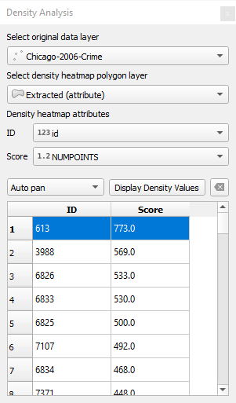
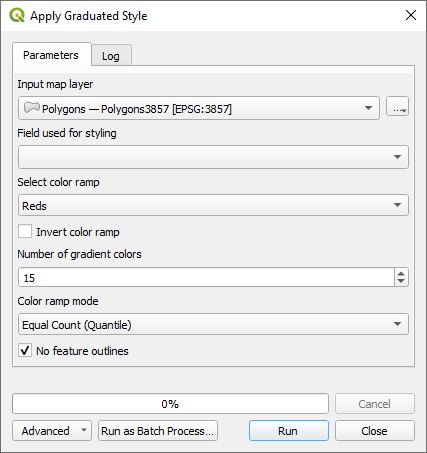

# QGIS Density Analysis Plugin

This plugin automates the creation of vector density heatmaps in QGIS with a heatmap explorer to examine the areas of greatest concentrations. Once installed, the plugin is located under ***Plugins->Density analysis*** in the QGIS menu. Some algorithms can also be found in the *Processing Toolbox*.

##  Create Kernel Density Grid

Given point features this will create a rectangle, diamond, or hexagon grid histogram of points that occur in each polygon grid cell. Here is an example of crime in Chicago. Each point on the left is some criminal event. On the right is a hexagon heatmap counting the number of events in each cell and displaying it as a heatmap. The darker the red, the more crime is in that area.

This shows the parameters used in the algorithm.

These are the input parameters:

* ***Input point vector layer*** - Select one of your point feature layers. Note that counting features in polygons is a time consuming process. If you have a large data set, make sure your input point vector layer has a spatial index; otherwise, this will be very slow.
* ***Grid extent*** - Select a grid extent. In this case the extent comes fom the extent of the input vector layer.
* ***Minimum cell histogram count*** - This is minimum number of features that need to be found within each cell for the cell to be created. A value of 0 will display the entire grid. A value of 1 means that at least one event was within the cell boundaries.
* ***Grid type*** - This is the grid type that is created. It can either be a rectangle, diamond, or hexagon. 
* ***Grid cell width*** - This is the width of the grid cell in the coordinate reference system (CRS) of the layer. This could be in degrees, meters, or feet so you will need to make sure it is set appropriately.
* ***Grid cell height*** - This is the height of the grid cell in the coordinate reference system (CRS) of the layer. This could be in degrees, meters, or feet so you will need to make sure it is set appropriately.
* ***Maximum grid width or height*** - This prevents a grid of huge proportions from being created and allows the user to correct the input parameters. If the width or height of the grid is exceeded, then it generates an error with a message of the grid size that would be created by the current settings and the cell width or height that needs to be used to fit within this grid size. You can always increase this number if you want a denser grid.
* ***Number of gradient colors*** - This specifies the number of categories that are going to be used. In this example we used 15. When we look at the output layer, it shows each category and the number of events that can occur within the category.

    

* ***Select a color ramp*** - This is a list of the QGIS color ramps (default Reds) that will be applied to the layer.
* ***Color ramp mode*** - Select one of Equal Count (Quantile), Equal Interval, Logarithmic scale ,Natural Breaks (Jenks), Pretty Breaks, or Standard Deviation.
* ***No feature outlines*** - If checked, it will not draw grid cell outlines.

##  Heatmap density analysis tool

With this tool you can quickly look at the top scoring values. Select the original point layer and the density heatmap polygon layer generated by the above algorithm. ID and Count will probably automatically select the right attribute, but ID should be set to a unique identifier, and count should be set to the histogram count attribute which is **NUMPOINTS**.

Once the parameters have been set, click on ***Display Density Values*** and the top scores will be listed. If you click on any of entries only that grid cell will be display and if ***Auto zoom*** is checked, QGIS will zoom into that feature. You can then see what features are within it. You can also click and drag to select more than one, or Ctrl-click to add or subtract from the selection. Here is an example view.

## Applying Graduated and Random Categorized Styles

The purpose of these two algorithms, is to set random and graduated styles using an algorithm. This makes it possible to set a layer's style in the model builder.

*  ***Apply a graduated style*** - This applies a graduated style to a layer. This is one of the building blocks to create a heatmap.

    

    This parallels the layer styling panel. It does not include all the styling parameters, but focuses on those which are important for heatmap styling. Select your input layer, the style field, select one of the color ramp names, mode and number of classes. Mode can be Equal Count (Quantile), Equal Interval, Logarithmic scale ,Natural Breaks (Jenks), Pretty Breaks, or Standard Deviation. If ***No feature outlines*** is checked, then the features will not have outlines.

*  ***Apply a random categorized style*** - This applies a random categorized style to a layer.

    

    
    Specify the input layer and the field to distinguish between different categories. If ***No feature outlines*** is checked, then the features will not have outlines.

